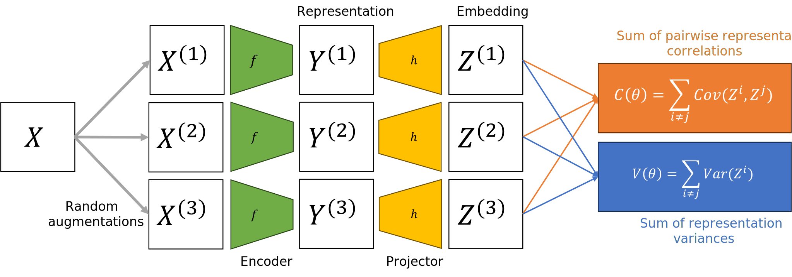

# SSL-EY: Maximizing Correlation in Self-Supervised Learning

**🔥💃It's. pronounced. "Slay".🕺🔥**

This repository hosts the official PyTorch implementation of SSL-EY (Self-Supervised Learning with an Eckhart-Young characterization), as detailed in

- [CCA with Shared Weights for Self-Supervised Learning](https://openreview.net/forum?id=7rYseRZ7Z3), presented at [NeurIPS 2023 Workshop: Self-Supervised Learning - Theory and Practice](https://neurips.cc/virtual/2023/80864)
- [Efficient Algorithms for the CCA Family: Unconstrained Objectives with Unbiased Gradients](https://arxiv.org/abs/2310.01012)

  

This repo provides a simplified PyTorch implementation designed around the [VICReg](https://github.com/facebookresearch/vicreg/blob/main/README.md) repository.

## Other Implementations

Our loss function plugs into public SSL software pipelines and all of the results in the paper were produced from our public fork of solo-learn.

### solo-learn

Access our solo-learn fork [here](https://github.com/jameschapman19/solo-learn)

### lightly

Access our solo-learn fork [here](https://github.com/jameschapman19/lightly)

## Pre-trained Models

You can choose to download only the weights of the pretrained backbone used for downstream tasks, or the full checkpoint which contains backbone and projection head weights.

<table>
  <tr>
    <th>arch</th>
    <th>params</th>
    <th>accuracy</th>
    <th colspan="6">download</th>
  </tr>
  <tr>
    <td>ResNet-50</td>
    <td>23M</td>
    <td>Work in Progress</td>
    <td>Work in Progress</td>
    <td>Work in Progress</td>
  </tr>
  <tr>
    <td>ResNet-50 (x2)</td>
    <td>93M</td>
    <td>75.5%</td>
    <td>Work in Progress</td>
    <td>Work in Progress</td>
  </tr>
  <tr>
    <td>ResNet-200 (x2)</td>
    <td>250M</td>
    <td>77.3%</td>
    <td>Work in Progress</td>
    <td>Work in Progress</td>
  </tr>
</table>

## Pretrained models on PyTorch Hub

Work in progress

## Training

Follow instructions on [VICReg](https://github.com/facebookresearch/vicreg)

## License

SSL-EY is released under the MIT License, allowing commercial use. See LICENSE for details.

## Citation

If you find this repository useful, please consider giving a star ⭐ and citation:

@misc{chapman2023efficient,
      title={Efficient Algorithms for the CCA Family: Unconstrained Objectives with Unbiased Gradients}, 
      author={James Chapman and Lennie Wells and Ana Lawry Aguila},
      year={2023},
      eprint={2310.01012},
      archivePrefix={arXiv},
      primaryClass={cs.LG}
}

@inproceedings{
chapman2023cca,
title={{CCA} with Shared Weights for Self-Supervised Learning},
author={James Chapman and Lennie Wells},
booktitle={NeurIPS 2023 Workshop: Self-Supervised Learning - Theory and Practice},
year={2023},
url={https://openreview.net/forum?id=7rYseRZ7Z3}
}
